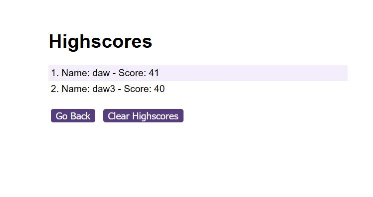

# Module 6 Challenge Web APIs: Code Quiz

## The Task:

As part of this week's challenge I waws tasked wioth creating a timed quiz, which will save my high scores. Due to the fact that as I proceed in my journey to becoming a front-end web developer, it’s likely that I will be asked to complete a coding assessment, perhaps as part of an interview process. A typical coding assessment is a combination of multiple-choice questions and interactive coding challenges. 

In order for me to become familiar with these tests and give me a chance to apply the skills from this module, this week’s challenge focused on building a timed coding quiz with multiple-choice questions. This app will run in the browser, and will feature dynamically updated HTML and CSS powered by JavaScript code that I wrote. I tried to make it have a clean, polished, and responsive user interface. However it was one of the harder challenges I have completed.


## The User Story:

```
AS A coding boot camp student
I WANT to take a timed quiz on JavaScript fundamentals that stores high scores
SO THAT I can gauge my progress compared to my peers
```

## Acceptance Criteria:

Create a code quiz that contains the following requirements:

* A start button that when clicked a timer starts and the first question appears.
 
  * Questions contain buttons for each answer.
  * 
  * When answer is clicked, the next question appears
  * 
  * If the answer clicked was incorrect then subtract time from the clock

* The quiz should end when all questions are answered or the timer reaches 0.

  * When the game ends, it should display their score and give the user the ability to save their initials and their score
  
## Mock-Up

The following animation demonstrates the application functionality:


## End Result:

This was the end result of the challenge. So I did not really alter the HTML and CSS that was provided with the challenge, and have utilized what was available.

Below screenshot show and example question in my quiz and the timer as well as high scores page link in the corner:


After completing the quiz, and typing your initials in the provided space, you can go to the high scores page to view your high scores listed highest to lowest as shown in below screenshot: 




## Conclusion:

I believe that this was on of the more complex challenges I have completed during the Bootcamp. I had to do a lot of re-reading and finding materials online in order to be able to complete this challenge. It certainly took me a lot longer than I initially anticipated but I think the result is really good, hopefully matching most of the criteria.This was a hard but fun and educational activity, which naturally boosted my skills as well as confidence. Which will hopefully come useful in the future challenges to come. However, it had also shown that I still have a lot to learn, which I am eager to do.


## Deployment:

* Following is a link to the final version of the Website: ''


## Grading Requirements

This challenge is graded based on the following criteria: 

### Technical Acceptance Criteria: 40%

* Satisfies all of the above acceptance criteria.

### Deployment: 32%

* Application deployed at live URL.

* Application loads with no errors.

* Application GitHub URL submitted.

* GitHub repository that contains application code.

### Application Quality: 15%

* Application user experience is intuitive and easy to navigate.

* Application user interface style is clean and polished.

* Application resembles the mock-up functionality provided in the challenge instructions.

### Repository Quality: 13%

* Repository has a unique name.

* Repository follows best practices for file structure and naming conventions.

* Repository follows best practices for class/id naming conventions, indentation, quality comments, etc.

* Repository contains multiple descriptive commit messages.

* Repository contains quality README file with description, screenshot, and link to deployed application.


## Review

You are required to submit BOTH of the following for review:

* The URL of the functional, deployed application.

* The URL of the GitHub repository. Give the repository a unique name and include a README describing the project.

---
© 2022 edX Boot Camps LLC. Confidential and Proprietary. All Rights Reserved.
